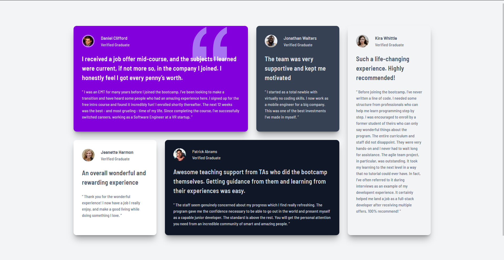

# Frontend Mentor - Testimonials Grid Section

## Table of contents

- [Overview](#overview)
  - [The challenge](#the-challenge)
  - [Screenshot](#screenshot)
  - [Links](#links)
- [My process](#my-process)
  - [Built with](#built-with)
  - [What I learned](#what-i-learned)
  - [Continued development](#continued-development)
- [Author](#author)

## Overview

### The challenge

Users should be able to:

- View the optimal layout for the site depending on their device's screen size

### Screenshot

### Links

- Repository URL: [https://github.com/solotechrics/testimonial-grid-section](https://github.com/solotechrics/testimonial-grid-section)
- Live Site URL: [https://solotechrics.github.io/testimonial-grid-section](https://solotechrics.github.io/testimonial-grid-section)

## My process

### Built with

- Semantic HTML5
- Tailwind CSS v4
- CSS Grid
- Mobile-first workflow

### What I learned

The biggest thing I learned from this challenge was how CSS Grid spanning works. Using `col-span` and `row-span` together to create an asymmetric card layout was something I had not done before. I also learned how to use the `order` property to maintain correct mobile stacking order while achieving a different arrangement on desktop.

I also got hands-on experience with Tailwind CSS v4's new `@utility` directive as a replacement for the old `@layer components`, and how to configure custom fonts using `@theme`.

### Continued development

Going forward I want to get more comfortable with complex grid layouts and practice more Tailwind v4 features.

## Author

- GitHub - [@solotechrics](https://github.com/solotechrics)
- Frontend Mentor - [@solotechrics](https://www.frontendmentor.io/profile/solotechrics)
- Twitter - [@Solorics_](https://twitter.com/Solorics_)